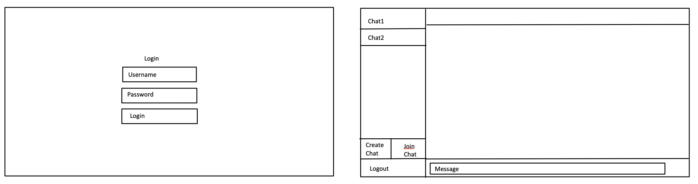
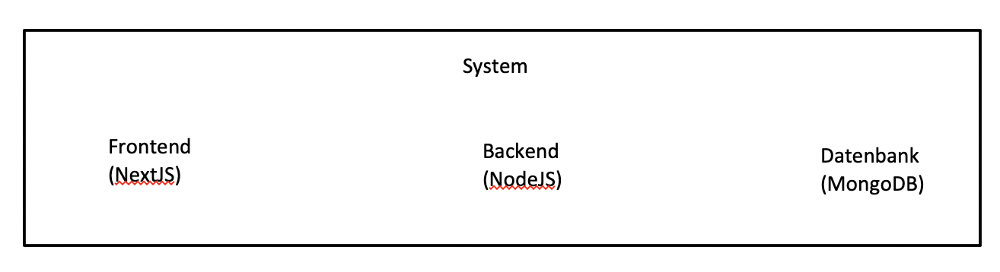
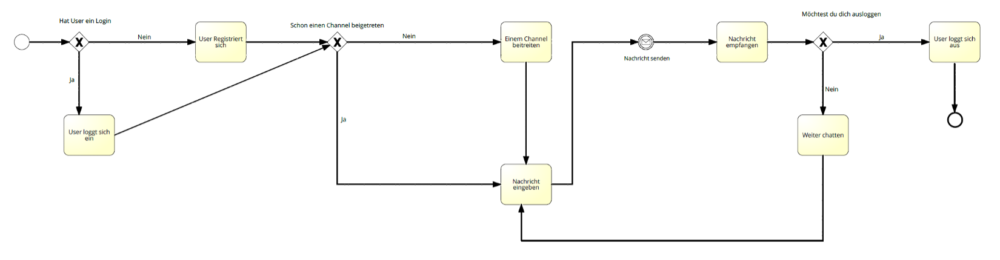

# No Meta Chat

## Idee
-	Formular mit Chat-Channels mit mehreren Leuten
-	Möglichkeit, einen neuen Channel zu erstellen
-	Möglichkeit einem Channel beizutreten / zu verlassen

## Skizze

## BPMN

## Use Cases
Registrierung:
-	Der Benutzer öffnet die App und wählt die Option zur Registrierung aus.
-	Er gibt seine persönlichen Informationen ein, einschließlich Benutzername und Passwort.
-	Nach erfolgreicher Registrierung erhält der Benutzer eine Bestätigung und kann sich nun einloggen.

Login:
-	Der registrierte Benutzer gibt seinen Benutzernamen und sein Passwort ein.
-	Die App authentifiziert die Informationen und gewährt Zugang zum Benutzerkonto.
-	Der Benutzer sieht nun seine personalisierte Startseite mit den verfügbaren Funktionen.

Channel erstellen:
-	Der Benutzer navigiert zur Channel-Erstellungsseite.
-	Er gibt einen Namen und eine Beschreibung für den neuen Channel ein.
-	Nach Bestätigung wird der Channel erstellt, und der Benutzer wird als Moderator hinzugefügt.

Channel beitreten:
-	Der Benutzer sucht nach verfügbaren Channels oder erhält eine Einladung.
-	Durch Auswahl eines Channels tritt der Benutzer diesem bei.
-	Der Benutzer kann nun Nachrichten innerhalb des Channels lesen und schreiben.

Logout:
-	Der Benutzer navigiert zu den Einstellungen oder seinem Profil.
-	Er wählt die Option "Ausloggen".
-	Die App beendet die aktuelle Sitzung des Benutzers und kehrt zum Anmeldebildschirm zurück.

## User Story
Als Benutzer möchte ich mich registrieren können, um ein persönliches Konto für die No Meta Chat zu erstellen und alle Funktionen nutzen zu können.

Als registrierter Benutzer möchte ich mich in die No Meta Chat einloggen können, um auf meine personalisierten Einstellungen und Nachrichten zuzugreifen.

Als Benutzer möchte ich in der Lage sein, Channels zu erstellen, um private oder öffentliche Gruppen für spezifische Interessen oder Projekte zu schaffen.

Als Benutzer möchte ich in der Lage sein, einem Channel beizutreten, um mit anderen Benutzern in Echtzeit zu kommunizieren und Nachrichten auszutauschen.

Als Benutzer möchte ich die Möglichkeit haben, mich aus der No Meta Chat auszuloggen, um meine persönlichen Informationen und Aktivitäten zu schützen, insbesondere wenn ich die App auf gemeinsam genutzten Geräten verwende.
